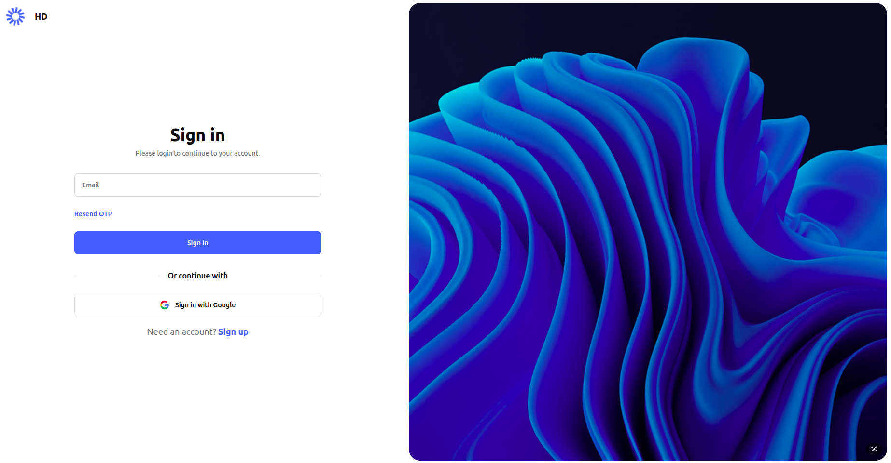
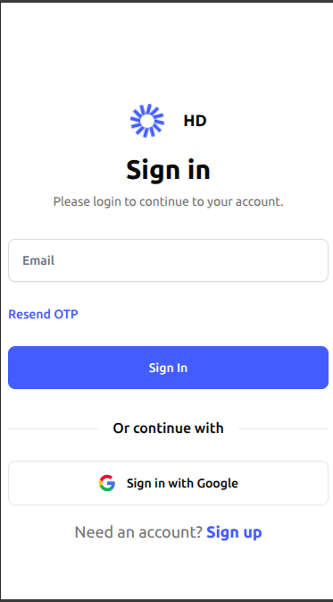
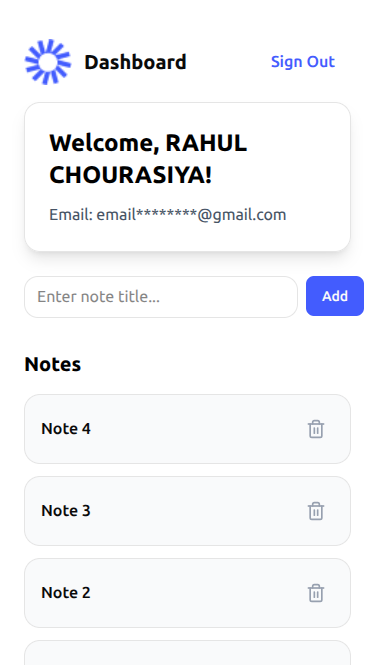

# 📝 Highway Notes

A full-stack **note-taking application** built with the MERN stack, Prisma ORM, and modern React libraries.
Users can sign up with **Email + OTP** or **Google OAuth**, create and delete notes securely, and manage their session using JWT-based authentication.

---

## 🖼️ Screenshots

### Desktop




### Mobile





---

## 🚀 Features

- 🔐 **Authentication**

  - Email + OTP flow for signup/login
  - Google OAuth integration
  - JWT-based session management with HttpOnly cookies

- 📝 **Notes Management**

  - Create and delete notes
  - User-specific notes only

- 📱 **Responsive Design**

  - Mobile-first UI matching provided Figma design

- ⚡ **Tech**

  - TypeScript across frontend & backend
  - React Hook Form + Zod for form validation
  - React Query for data fetching
  - Prisma ORM + MongoDB
  - Node.js + Express backend

---

## 📂 Project Structure

```txt
.
├── backend/          # Express + Prisma backend
│   ├── src/
│   │   ├── controllers/   # Auth & Notes controllers
│   │   ├── routes/        # API routes
│   │   ├── services/      # Business logic
│   │   ├── middlewares/   # Auth & validation
│   │   └── utils/         # JWT, helpers
│   └── prisma/            # Prisma schema
│
├── frontend/         # React + Vite + TypeScript frontend
│   ├── src/
│   │   ├── features/      # Auth & Dashboard features
│   │   ├── components/    # Reusable UI components
│   │   ├── routeHandler/  # Protected & Public routes
│   │   └── pages/         # Page components
│
├── assets/           # Design screenshots
│   ├── DesktopSignin.png
│   ├── DesktopSignup.png
│   ├── MobileSignin.png
│   ├── MobileSignup.png
│   └── MobileDashboard.png
└── Readme.md
```

---

## ⚙️ Setup & Installation

### 1️⃣ Backend

```bash
cd backend
pnpm install   # or npm install
```

Run database migrations:

```bash
pnpm prisma migrate dev
```

Start backend:

```bash
pnpm dev
```

---

### 2️⃣ Frontend

```bash
cd frontend
pnpm install   # or npm install
```

Create `frontend/.env`:

```env
VITE_BACKEND_URL=http://localhost:4002
```

Start frontend:

```bash
pnpm dev
```

---

## 🌐 Deployment

- Deployed on: `https://hd.rcmade.me/`

---

## 📜 Scripts

### Backend

- `pnpm dev` – run in development with hot reload
- `pnpm build` – build for production
- `pnpm start` – start compiled server

### Frontend

- `pnpm dev` – start Vite dev server
- `pnpm build` – build production bundle
- `pnpm preview` – preview production build

---
